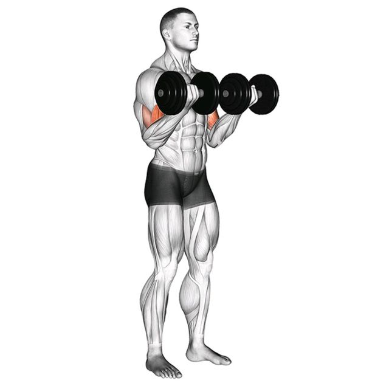

# Bicep Curl

#biceps #arms #dumbbell

## Description
Упражнение для изолированной проработки бицепса.

Техника выполнения:
- Возьми гантели в руки
- Локти держи прижатыми к корпусу
- Поднимай гантели без раскачки

Советы:
- Не используй инерцию
- Контролируй движение вниз